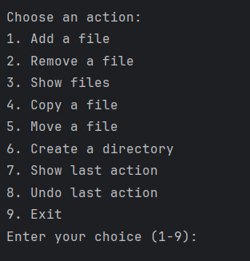
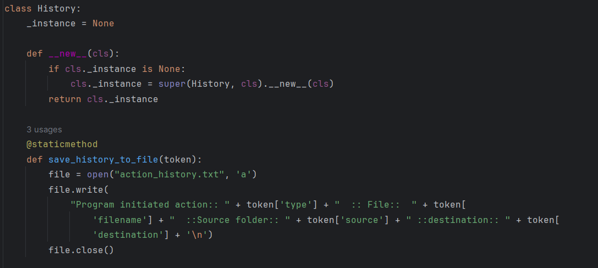
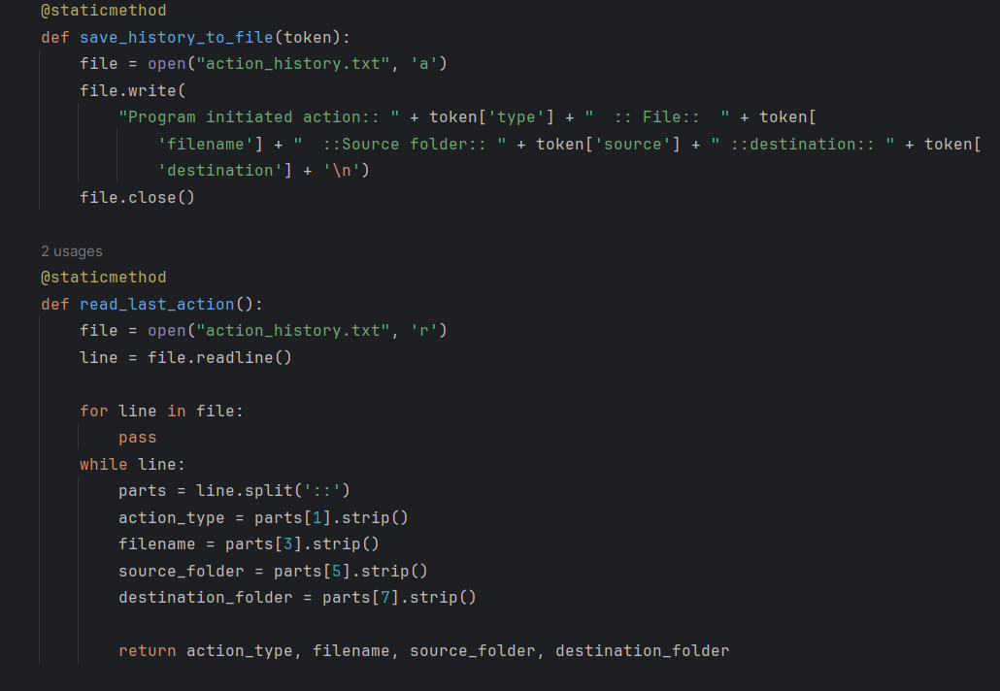

# Course Work

 OOP Coursework. VILNIUS TECH.

## File Manager

### Dependencies

- os (For operating system interfaces) `pip install os`
- shutil (For file operations) `pip install shutil`

### Idea

This Python script offers a versatile solution for managing both 
file and directory operations. Utilizing object-oriented programming 
and design patterns, it supports tasks like file creation, removal,
copying, and moving, along with directory creation. With its command-line 
interface, users can efficiently manage their file systems.

### How to run?

Clone the repository, install the necessary dependencies and run `python main.py`.

## The 4 pillars of OOP
### Polymorphism and Inheritance
Polymorphism is demonstrated through the Command class, which is an abstract base 
class (ABC) defining the execute() method. Each concrete command class (AddFile, 
RemoveFile, CopyFile, MoveFile, CreateDirectory) inherits from the Command class and 
implements its own version of the execute() method.

Inheritance is demonstrated through the relationship between the concrete command 
classes (AddFile, RemoveFile, CopyFile, MoveFile, CreateDirectory) and the abstract 
base class Command.
Each concrete command class inherits the method signature execute() from the Command 
class, establishing a common interface for performing file system operations.

### Abstraction

The Command class serves as an abstract base class (ABC) that defines a common 
interface for executing file system operations.

### Encapsulation

Attributes such as __actions, __source_directory, __destination_directory, and 
__last_file_name within the Action class are private. Access to these 
attributes is provided through getter methods.

Methods like save_file_contents_to_list() within the Action and RemoveFile 
classes are also private. These methods encapsulate the implementation 
details of specific functionalities (saving file contents to a list) 
and are meant to be used internally within their respective classes.

## Design patterns

### Singleton

The Singleton design pattern ensures that a class has only one instance and provides 
a global point of access to that instance. In this code, the History class is 
implemented using the Singleton pattern. Singleton is used to restore last action.

### Command

The Command Design Pattern turns a request into a stand-alone object.
The Command design pattern in this code is used to structure methods to execute 
file manager actions. Each action is its own object derived from the abstract class 
Command(ABC) and implements the method execute(). 

## Reading from and writing to a file

When creating the file manager, I considered about using a file to store the action history.

The code utilizes file I/O operations for saving and reading history actions 
in a text file named "action_history.txt". These functionalities support the 
implementation of features like displaying the last action performed and enabling 
the undo functionality provided by the Restore class. 

## Testing

By using unittest i was able to test file manager actions. Testing helped me to find
minor code bugs and complete functionality. 

## Code Style
The code style is following the PEP8 style guidelines.

## Results

- The program successfully implements basic file management operations such as creating, removing, copying, 
and moving files, as well as creating directories. 
- The program utilizes the Command design pattern to encapsulate each operation as an object, providing a 
structured and extensible approach to implementing file management actions.
- A key feature of the program is its ability to undo the last file management action performed by the user.
- The program maintains a log of all file management actions performed by the user, recording details such as the 
type of action, file names, source, and destination folders. 
- The program offers a simple and intuitive command-line interface for interacting with the file manager.

## Conclusion

In conclusion, the file manager project has effectively demonstrated basic file management functionalities with a 
user-friendly interface. While the implementation successfully utilizes the Command design pattern for flexibility 
and includes features like undo and action logging, there is room for improvement in error handling and user input 
validation. Despite these limitations, the program's simplicity and modularity make it accessible and maintainable.
Looking ahead, enhancing features such as error handling and adding advanced functionalities like file synchronization 
could further improve its utility. Overall, the project provides valuable insights into software design principles and 
offers a foundation for future enhancements and exploration of alternative approaches.

