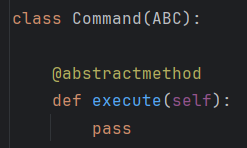

# Course Work

 OOP Coursework. VILNIUS TECH.

## File Manager

### Dependencies

- os (For operating system interfaces) `pip install os`
- shutil (For file operations) `pip install shutil`

### Idea

This Python script offers a versatile solution for managing both 
file and directory operations. Utilizing object-oriented programming 
and design patterns, it supports tasks like file creation, removal,
copying, and moving, along with directory creation. With its command-line 
interface, users can efficiently manage their file systems.

### How to run?

Clone the repository, install the necessary dependencies and run `python main.py`.

## The 4 pillars of OOP
### Polymorphism and Inheritance
Polymorphism is demonstrated through the Command class, which is an abstract base 
class (ABC) defining the execute() method. Each concrete command class (AddFile, 
RemoveFile, CopyFile, MoveFile, CreateDirectory) inherits from the Command class and 
implements its own version of the execute() method.

Inheritance is demonstrated through the relationship between the concrete command 
classes (AddFile, RemoveFile, CopyFile, MoveFile, CreateDirectory) and the abstract 
base class Command.
Each concrete command class inherits the method signature execute() from the Command 
class, establishing a common interface for performing file system operations.

### Abstraction

The Command class serves as an abstract base class (ABC) that defines a common 
interface for executing file system operations.

### Encapsulation

Attributes such as __actions, __source_directory, __destination_directory, and 
__last_file_name within the Action class are private. Access to these 
attributes is provided through getter methods.

Methods like save_file_contents_to_list() within the Action and RemoveFile 
classes are also private. These methods encapsulate the implementation 
details of specific functionalities (saving file contents to a list) 
and are meant to be used internally within their respective classes.

## Design patterns

### Singleton

The Singleton design pattern ensures that a class has only one instance and provides 
a global point of access to that instance. In this code, the History class is 
implemented using the Singleton pattern. Singleton is used to restore last action.

### Command

The Command Design Pattern turns a request into a stand-alone object.
The Command design pattern in this code is used to structure methods to execute 
file manager actions. Each action is its own object derived from the abstract class 
Command(ABC) and implements the method execute(). 

## Reading from and writing to a file

When creating the file manager, I considered about using a file to store the action history.

The code utilizes file I/O operations for saving and reading history actions 
in a text file named "action_history.txt". These functionalities support the 
implementation of features like displaying the last action performed and enabling 
the undo functionality provided by the Restore class. 

## Testing

By using unittest i was able to test file manager actions. Testing helped me to find
minor code bugs and complete functionality. 

## Code Style
The code style is following the PEP8 style guidelines.

## Results

- Working on this project helped me to understand OOP principles.
- Implementation of Design Patterns helped me to further expand my knowledge about 
programming.
- Using unittest helped me to test my program's functionality and troubleshoot
errors.

## Conclusion

Through this coursework, I've embarked on a journey of learning fundamental 
programming concepts and applying them to practical scenarios. Embracing 
Object-Oriented Programming (OOP) principles has empowered me to organize 
code more intuitively, fostering code reuse. Additionally, 
exploring design patterns like the Command and Singleton patterns has introduced 
me to powerful solutions for common programming challenges. As a newcomer to 
programming, this coursework has not only equipped me with technical skills 
but also instilled in me a deeper understanding of software design principles, 
setting a strong foundation for future projects.

